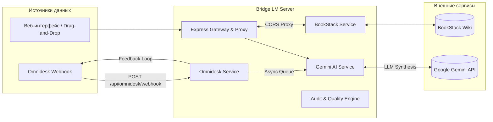

# Bridge.LM — Интеллектуальный синхронизатор базы знаний BookStack

<div align="center">

**Автоматическая трансформация тикетов техподдержки, логов и документации в верифицированные статьи BookStack Wiki с помощью Google Gemini AI**

[](#стек-технологий)
[](#стек-технологий)
[](#стек-технологий)
[](#развертывание-в-docker)
[](https://github.com/Butey/Bridge.LM/pkgs/container/bridge.lm)
[](https://www.gnu.org/licenses/gpl-3.0)

</div>

---

## 📋 О проекте

**Bridge.LM** — это комплексная система на стыке Service Desk и корпоративной базы знаний. Система анализирует «сырые» данные техподдержки (диалоги операторов, аварийные логи, конфигурационные дампы, скриншоты), извлекает инженерную суть и формирует стандартизированные статьи для [BookStack](https://www.bookstackapp.com/) с интерактивными схемами, чек-листами и регламентами.

### Ключевые возможности

- 🧠 **Многостадийный конвейер синтеза (Multi-Stage Synthesis):**
  - **Stage 1 (Планирование):** Извлечение симптомов, первопричин (Root Cause), шагов воспроизведения и формирование плана статьи.
  - **Stage 2 (Сборка Markdown):** Генерация статьи строго по стандартам BookStack (Callout-блоки, таблицы, подсветка синтаксиса, Mermaid-диаграммы).
  - **Stage 3 (Критика и аудит):** Проверка полноты, устранение галлюцинаций, вычитка терминологии и удаление машинных клише.
- ⚡ **Автономный Omnidesk Webhook Pipeline:**
  - Асинхронный приём событий из хелпдеска Omnidesk (`POST /api/omnidesk/webhook`) с немедленным ответом `202 Accepted`.
  - Фоновый pull содержимого тикета и вложений через Omnidesk API.
  - Автоматическая классификация и размещение созданной статьи в подходящую книгу/главу BookStack.
  - Двусторонняя обратная связь: автоматическое добавление внутренней заметки в тикет со ссылкой на созданную статью и простановка тега `wiki-created`.
  - Защита вебхука через подпись/секрет (`OMNIDESK_WEBHOOK_SECRET`).
- 🔍 **RAG и семантический контекст BookStack:**
  - Поиск смежных статей через BookStack API (MySQL Boolean Full-Text Search).
  - Учёт зависимостей (Prerequisites), предотвращение дубликатов и автоматическая перекрёстная линковка.
- 🎯 **Система агентных навыков (Agent Skills):**
  - `no-ai-slop`: очистка от шаблонных нейросетевых клише и «воды».
  - `humanizer-ru`: профессиональный инженерный русский язык с активным залогом.
  - `kb-article`: оформление согласно индустриальным практикам (Google SRE Post-Mortem, Runbook, Troubleshooting).
  - Поддержка загрузки и настройки пользовательских навыков через UI.
- 📊 **Интерактивный UI:**
  - Режим ручного рецензирования (Review Mode) перед публикацией в живую Wiki.
  - Панель детального аудита качества статьи (Article Audit Panel).
  - Визуализация Mermaid.js диаграмм и D3-графов (Mindmap).
  - Загрузка источников различных форматов (PDF, HTML, TXT, изображения) через шлюз с конвертацией `markitdown`.

---

## 🏗 Архитектура



Подробные архитектурные схемы и решения доступны в каталоге [`docs/`](./docs):
- [Спецификация интеграции Omnidesk](./docs/OMNIDESK_INTEGRATION.md)
- [Диаграммы последовательностей и компонентов](./docs/architecture_diagram.md)
- [Реестр архитектурных решений (ADR)](./docs/adr/)

---

## 🛠 Стек технологий

| Уровень | Технологии |
| :--- | :--- |
| **Frontend** | React 19, TypeScript, Vite 6, Tailwind CSS 4, Motion (framer-motion), Lucide React, React Markdown |
| **Backend** | Node.js (20+), Express 4, TypeScript, tsx, esbuild, Multer |
| **Искусственный интеллект** | Google Gemini API (`@google/genai`), модели Gemini 2.5 Flash / Pro |
| **Интеграции** | BookStack REST API, Omnidesk API, MarkItDown |
| **Визуализация** | Mermaid.js, D3.js (динамическая CDN-загрузка без утяжеления бандла) |
| **Контейнеризация** | Docker, Docker Compose (оптимизированный Multi-Stage build на базе Alpine) |

---

## 🚀 Быстрый старт

### Требования
- Node.js 20+ и npm (или Docker)
- API-ключ [Google Gemini AI Studio](https://aistudio.google.com/)
- Учётные данные BookStack API (Token ID и Token Secret)

### 1. Клонирование репозитория

```bash
git clone https://github.com/Butey/Bridge.LM.git
cd Bridge.LM
```

### 2. Настройка переменных окружения

Скопируйте пример файла конфигурации:

```bash
cp .env.example .env
```

Отредактируйте `.env`:

```env
# Google Gemini AI (обязательно)
GEMINI_API_KEY=ваш_ключ_gemini

# BookStack API (опционально, можно также задать в UI)
BOOKSTACK_BASE_URL=https://wiki.yourdomain.com
BOOKSTACK_TOKEN_ID=ваш_token_id
BOOKSTACK_TOKEN_SECRET=ваш_token_secret

# Пароль для изменения настроек через веб-интерфейс
ADMIN_PASSWORD=ваш_надежный_пароль

# Интеграция с Omnidesk (опционально)
OMNIDESK_DOMAIN=yourcompany
OMNIDESK_EMAIL=admin@yourcompany.com
OMNIDESK_API_KEY=ваш_api_key_omnidesk
OMNIDESK_WEBHOOK_SECRET=секретный_токен_вебхука
```

### 3. Локальный запуск (Development)

```bash
# Установка зависимостей
npm install

# Запуск dev-сервера с горячей перезагрузкой
npm run dev
```

Приложение будет доступно по адресу: **http://localhost:3000**

---

## 🐳 Развертывание в Docker

### Вариант 1. Запуск готового публичного Docker-образа (Рекомендуется)

Готовый образ автоматически собирается и публикуется в GitHub Container Registry (`ghcr.io`):

```bash
# Быстрый запуск одной командой
docker run -d \
  -p 3000:3000 \
  --name bridge-lm \
  --env-file .env \
  --restart unless-stopped \
  ghcr.io/butey/bridge.lm:latest
```

### Вариант 2. Запуск через Docker Compose

```bash
# Запуск с автоматическим подтягиванием публичного образа
docker compose up -d

# Или сборка из локальных исходников
docker compose up -d --build

# Просмотр логов
docker compose logs -f
```

Контейнер будет запущен и доступен по адресу: **http://localhost:3000**

---

## 📜 Скрипты проекта

В `package.json` настроены следующие команды:

- `npm run dev` — запуск сервера и интерфейса в режиме разработки (`tsx`).
- `npm run build` — сборка фронтенда через Vite и бэкенда через `esbuild` в каталог `dist/`.
- `npm run start` — запуск собранного продакшн-сервера (`dist/server.cjs`).
- `npm run clean` — очистка каталога сборки `dist/`.
- `npm run lint` — проверка типов TypeScript (`tsc --noEmit`).

---

## 🔒 Безопасность

- **Серверный шлюз-прокси:** Все вызовы к BookStack API и Omnidesk API проходят через бэкенд (`/api/bookstack/proxy`). Секретные токены и ключи никогда не передаются в браузер клиента.
- **Изоляция секретов:** Файлы конфигурации `.env` защищены правилами `.gitignore` и исключены из сборок.
- **Подпись вебхуков:** Эндпоинт `/api/omnidesk/webhook` валидирует входящие запросы по токену `OMNIDESK_WEBHOOK_SECRET`.
- **Контейнерная безопасность:** В Docker-контейнере приложение запускается под непривилегированным пользователем `node`.

---

## 📄 Лицензия

Этот проект распространяется под свободной лицензией **GNU General Public License v3.0 (GPLv3)**. Полный текст условий приведён в файле [LICENSE](LICENSE).

Bridge.LM — свободное программное обеспечение: вы можете распространять и/или модифицировать его в соответствии с условиями Стандартной общественной лицензии GNU (GNU General Public License) в том виде, в каком она была опубликована Фондом свободного программного обеспечения; либо версии 3 лицензии, либо (по вашему выбору) любой более поздней версии.
