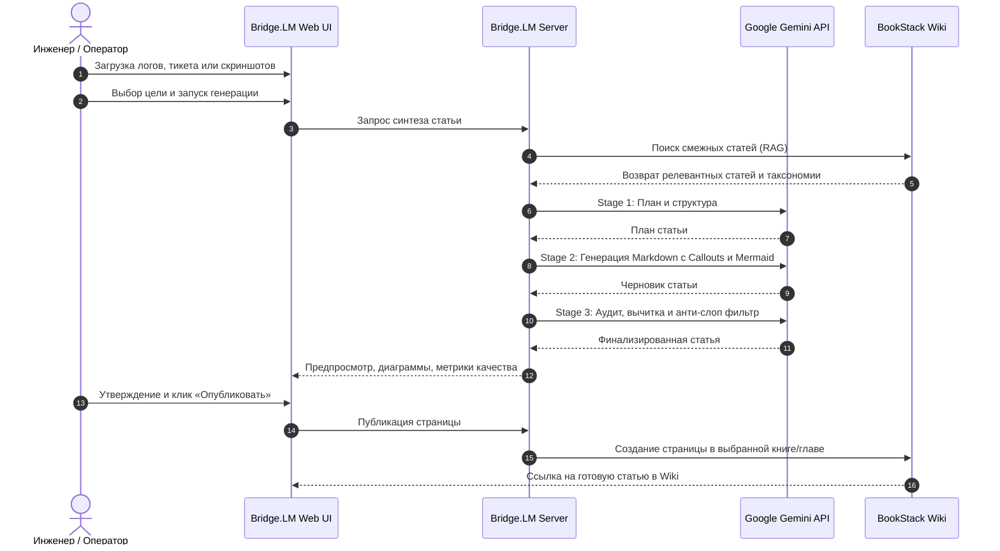

# Bridge.LM — Интеллектуальный синхронизатор базы знаний BookStack

<div align="center">

**Автоматическая трансформация тикетов техподдержки, системных логов и документации в верифицированные статьи BookStack Wiki с помощью Google Gemini AI**

[](https://github.com/Butey/Bridge.LM/releases)
[](https://github.com/Butey/Bridge.LM/pkgs/container/bridge.lm)
[](#стек-технологий)
[](#стек-технологий)
[](#стек-технологий)
[](https://www.gnu.org/licenses/gpl-3.0)

</div>

---

## 📋 Оглавление

1. [О проекте](#-о-проекте)
2. [Ключевые возможности](#-ключевые-возможности)
3. [Архитектура системы](#-архитектура-системы)
4. [Пользовательский сценарий (Workflow)](#-пользовательский-сценарий-workflow)
5. [Система агентных навыков (Agent Skills)](#-система-агентных-навыков-agent-skills)
6. [API эндпоинты](#-api-эндпоинты)
7. [Интеграция с Omnidesk (Webhooks)](#-интеграция-с-omnidesk-webhooks)
8. [Стек технологий](#-стек-технологий)
9. [Быстрый старт](#-быстрый-старт)
10. [Развертывание в Docker](#-развертывание-в-docker)
11. [Безопасность](#-безопасность)
12. [Лицензия](#-лицензия)

---

## 🌟 О проекте

**Bridge.LM** — это специализированная платформа для инженерных команд и технической поддержки, решающая проблему фрагментации знаний. 

В повседневной работе ценные технические решения остаются «похороненными» в закрытых тикетах хелпдеска, аварийных логах и переписках инженеров. Bridge.LM автоматически извлекает инженерную суть, отделяет симптомы от первопричины (Root Cause) и формирует кристально структурированные статьи базы знаний [BookStack](https://www.bookstackapp.com/) со схемами процессов, таблицами неисправностей и инструкциями первой помощи.

---

## ⚡ Ключевые возможности

- 🧠 **Многостадийный конвейер синтеза (Multi-Stage Pipeline):**
  - **Stage 1 (Анализ и планирование):** Извлечение симптомов, первопричин, затронутых компонентов и формирование логической структуры статьи.
  - **Stage 2 (Сборка Markdown):** Генерация статьи строго по стандартам BookStack (нативные Callout-блоки, таблицы, подсветка синтаксиса, диаграммы Mermaid.js).
  - **Stage 3 (Критика и аудит качества):** Автоматическая вычитка, устранение галлюцинаций, нормализация терминологии и удаление машинных клише.
- 🔄 **Автономный Omnidesk Webhook Pipeline:**
  - Асинхронный приём событий (`POST /api/omnidesk/webhook`) с мгновенным подтверждением `202 Accepted`.
  - Фоновый pull содержимого тикета и вложений через API.
  - Автоматическая классификация и размещение статьи в подходящую книгу/главу BookStack.
  - Двусторонняя обратная связь: автоматическое добавление внутренней заметки в тикет со ссылкой на созданную статью и простановка тега `wiki-created`.
  - Валидация подлинности запроса по секрету (`OMNIDESK_WEBHOOK_SECRET`).
- 🔍 **RAG и семантический поиск в BookStack:**
  - Умный поиск смежных статей через BookStack API (MySQL Boolean Full-Text Search).
  - Предотвращение дубликатов статей и автоматическая перекрёстная линковка зависимостей (Prerequisites).
- 📊 **Интерактивный UI:**
  - Режим ручного рецензирования (Review Mode) перед публикацией в живую Wiki.
  - Панель детального аудита качества (Article Audit Panel).
  - Интерактивный рендеринг Mermaid.js схем и D3-графов (Mindmap).
  - Загрузка источников любых форматов (PDF, HTML, TXT, изображения) через шлюз `markitdown`.

---

## 🏗 Архитектура системы


Подробная проектная документация доступна в каталоге [`docs/`](./docs):
- [Спецификация интеграции Omnidesk](./docs/OMNIDESK_INTEGRATION.md)
- [Диаграммы компонентов и последовательностей](./docs/architecture_diagram.md)
- [Реестр архитектурных решений (ADR)](./docs/adr/)

---

## 🧭 Пользовательский сценарий (Workflow)



---

## 🎯 Система агентных навыков (Agent Skills)

В Bridge.LM встроена модульная система специализированных когнитивных навыков, обогащающих контекст ИИ:

| Навык | Категория | Описание |
| :--- | :--- | :--- |
| **`no-ai-slop`** | Стиль | Вычищает шаблонные нейросетевые клише («ни для кого не секрет», «важно отметить»), канцелярские обороты и вводную «воду». |
| **`humanizer-ru`** | Локализация | Приводит текст к естественному инженерному русскому языку в активном залоге с точной профессиональной терминологией. |
| **`kb-article`** | Структура | Оформляет документацию по методологиям Blameless Post-Mortem, Google SRE Runbook и экспресс-диагностики. |
| **`log-analyzer`** | Анализ | Распознает паттерны в стектрейсах, логах и дампах ошибок, выделяя регулярные выражения для быстрой диагностики. |
| **`mermaid-expert`** | Схемы | Генерирует читаемые диаграммы Mermaid.js (Sequence, Flowchart, State) для визуализации алгоритмов устранения неполадок. |
| **`plan-writing`** | Планирование | Создает детализированный многошаговый план структуры статьи в Stage 1 перед написанием черновика. |

---

## 🔌 API эндпоинты

| Метод | Эндпоинт | Описание | Аутентификация |
| :--- | :--- | :--- | :--- |
| `POST` | `/api/omnidesk/webhook` | Приём вебхуков от Omnidesk для асинхронного создания статей | `X-Omnidesk-Secret` / Query `?secret=` |
| `ALL` | `/api/bookstack/proxy/*` | Защищенный шлюз-прокси к BookStack API (обход CORS) | Серверный Token ID & Secret |
| `POST` | `/api/process-source` | Приём и парсинг файлов (PDF, HTML, TXT, изображения) | Ограничение по размеру |
| `GET` | `/api/settings` | Получение сохраненных пресетов и настроек | Публичный |
| `POST` | `/api/settings` | Сохранение настроек и кастомных системных промптов | `ADMIN_PASSWORD` |
| `GET` | `/api/config` | Проверка наличия и статуса переменных окружения | Публичный |

---

## 📬 Интеграция с Omnidesk (Webhooks)

Bridge.LM поддерживает сквозной автоматический цикл: **«Тикет решён в хелпдеске → Статья создана в BookStack → Ссылка возвращена в тикет»**.

### Настройка правила в Omnidesk:
1. Перейдите в **Omnidesk** → **Настройки** → **Правила** → **Правила для изменившихся тикетов**.
2. Добавьте условие: например, `Статус равен: Закрыт` и `Тег содержит: wiki`.
3. Добавьте действие: **Отправить webhook**:
   - **URL:** `https://your-bridge-domain.com/api/omnidesk/webhook?secret=ВАШ_СЕКРЕТ`
   - **Метод:** `POST`
   - **Тело запроса (JSON):**
     ```json
     {
       "ticket_id": "",
       "subject": ""
     }
     ```
4. При срабатывании Bridge.LM вернет HTTP `202 Accepted`, в фоне скачает переписку, напишет статью, создаст страницу в BookStack и добавит внутреннюю заметку в тикет Omnidesk со ссылкой на новую статью.

Подробная инструкция: [`docs/OMNIDESK_INTEGRATION.md`](./docs/OMNIDESK_INTEGRATION.md).

---

## 🛠 Стек технологий

- **Frontend:** React 19, TypeScript, Vite 6, Tailwind CSS 4, Motion (framer-motion), Lucide React, React Markdown.
- **Backend:** Node.js 20+, Express 4, TypeScript, tsx, esbuild, Multer.
- **Искусственный интеллект:** Google Gemini API (`@google/genai`), модели Gemini 2.5 Flash / Pro.
- **Интеграции:** BookStack REST API, Omnidesk API, MarkItDown.
- **Визуализация:** Mermaid.js, D3.js (динамическая CDN-загрузка).
- **Контейнеризация:** Docker, Docker Compose, GitHub Container Registry (`ghcr.io`).

---

## 🚀 Быстрый старт

### Требования
- Node.js 20+ и npm (или Docker)
- API-ключ [Google Gemini AI Studio](https://aistudio.google.com/)
- Учётные данные BookStack API (Token ID и Token Secret)

### 1. Клонирование репозитория

```bash
git clone https://github.com/Butey/Bridge.LM.git
cd Bridge.LM
```

### 2. Настройка переменных окружения

Скопируйте пример файла конфигурации:

```bash
cp .env.example .env
```

Отредактируйте `.env`:

```env
# Google Gemini AI (обязательно)
GEMINI_API_KEY=ваш_ключ_gemini

# BookStack API (опционально, можно задать через UI)
BOOKSTACK_BASE_URL=https://wiki.yourdomain.com
BOOKSTACK_TOKEN_ID=ваш_token_id
BOOKSTACK_TOKEN_SECRET=ваш_token_secret

# Пароль для изменения настроек через веб-интерфейс
ADMIN_PASSWORD=ваш_надежный_пароль

# Интеграция с Omnidesk (опционально)
OMNIDESK_DOMAIN=yourcompany
OMNIDESK_EMAIL=admin@yourcompany.com
OMNIDESK_API_KEY=ваш_api_key_omnidesk
OMNIDESK_WEBHOOK_SECRET=секретный_токен_вебхука
```

### 3. Локальный запуск (Development)

```bash
# Установка зависимостей
npm install

# Запуск dev-сервера с горячей перезагрузкой
npm run dev
```

Приложение будет доступно по адресу: **http://localhost:3000**

---

## 🐳 Развертывание в Docker

### Вариант 1. Запуск готового публичного Docker-образа (Рекомендуется)

Готовый образ автоматически собирается и публикуется в GitHub Container Registry (`ghcr.io`):

```bash
# Быстрый запуск одной командой
docker run -d \
  -p 3000:3000 \
  --name bridge-lm \
  --env-file .env \
  --restart unless-stopped \
  ghcr.io/butey/bridge.lm:latest
```

### Вариант 2. Запуск через Docker Compose

```bash
# Запуск с автоматическим подтягиванием публичного образа
docker compose up -d

# Или сборка из локальных исходников
docker compose up -d --build

# Просмотр логов
docker compose logs -f
```

Контейнер будет запущен и доступен по адресу: **http://localhost:3000**

---

## 🔒 Безопасность

- **Серверный шлюз-прокси:** Все вызовы к BookStack API и Omnidesk API проходят через бэкенд (`/api/bookstack/proxy`). Секретные токены и ключи никогда не передаются в браузер клиента.
- **Изоляция секретов:** Конфигурация `.env` защищена правилами `.gitignore` и исключена из Docker-образов.
- **Подпись вебхуков:** Эндпоинт `/api/omnidesk/webhook` валидирует входящие запросы по токену `OMNIDESK_WEBHOOK_SECRET`.
- **Контейнерная безопасность:** В Docker-образе приложение запускается под непривилегированным пользователем `node`.

---

## 📄 Лицензия

Этот проект распространяется под свободной лицензией **GNU General Public License v3.0 (GPLv3)**. Полный текст условий приведён в файле [LICENSE](LICENSE).

Bridge.LM — свободное программное обеспечение: вы можете распространять и/или модифицировать его в соответствии с условиями Стандартной общественной лицензии GNU (GNU General Public License) в том виде, в каком она была опубликована Фондом свободного программного обеспечения; либо версии 3 лицензии, либо (по вашему выбору) любой более поздней версии.
