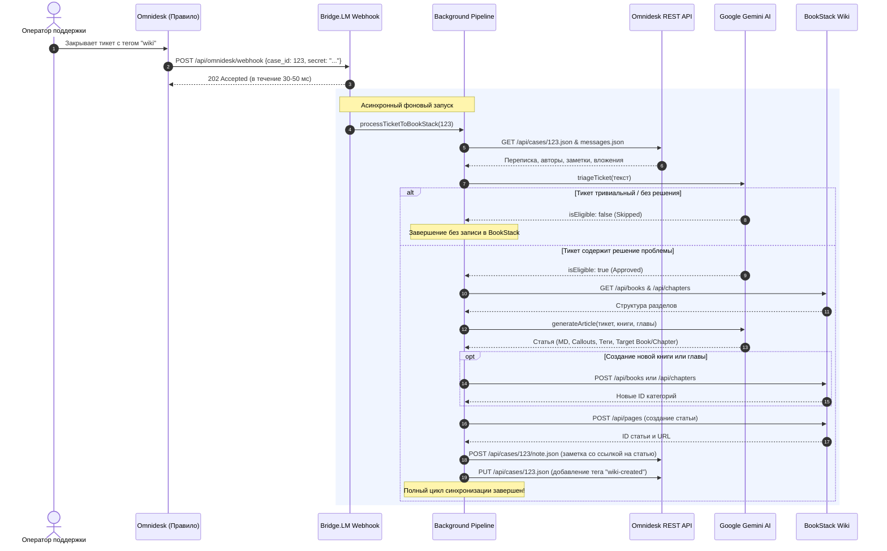
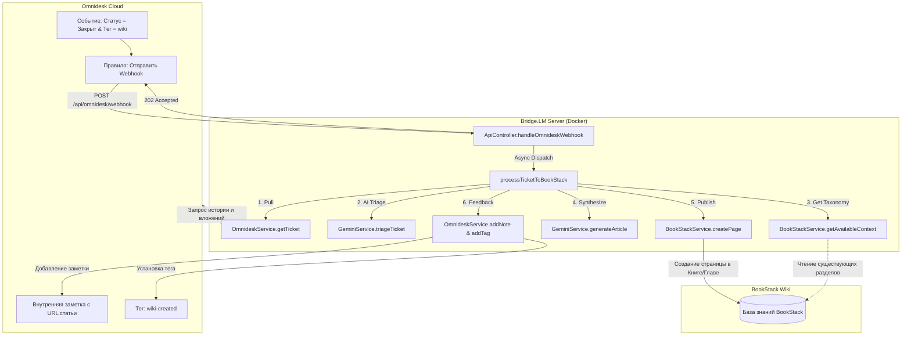

# Архитектурная диаграмма: Автоматизация Omnidesk -> BookStack

## 1. Схема последовательности (Sequence Diagram)

```mermaid
sequenceDiagram
    autonumber
    actor Staff as Оператор поддержки
    participant Omni as Omnidesk (Правило)
    participant Bridge as Bridge.LM Webhook
    participant Worker as Background Pipeline
    participant OmniAPI as Omnidesk REST API
    participant Gemini as Google Gemini AI
    participant BookStack as BookStack Wiki

    Staff->>Omni: Закрывает тикет с тегом "wiki"
    Omni->>Bridge: POST /api/omnidesk/webhook {case_id: 123, secret: "..."}
    Bridge-->>Omni: 202 Accepted (в течение 30-50 мс)
    
    rect rgb(240, 245, 255)
    Note over Bridge,Worker: Асинхронный фоновый запуск
    Bridge->>Worker: processTicketToBookStack(123)
    Worker->>OmniAPI: GET /api/cases/123.json & messages.json
    OmniAPI-->>Worker: Переписка, авторы, заметки, вложения
    
    Worker->>Gemini: triageTicket(текст)
    alt Тикет тривиальный / без решения
        Gemini-->>Worker: isEligible: false (Skipped)
        Note over Worker: Завершение без записи в BookStack
    else Тикет содержит решение проблемы
        Gemini-->>Worker: isEligible: true (Approved)
        Worker->>BookStack: GET /api/books & /api/chapters
        BookStack-->>Worker: Структура разделов
        Worker->>Gemini: generateArticle(тикет, книги, главы)
        Gemini-->>Worker: Статья (MD, Callouts, Теги, Target Book/Chapter)
        
        opt Создание новой книги или главы
            Worker->>BookStack: POST /api/books или /api/chapters
            BookStack-->>Worker: Новые ID категорий
        end
        
        Worker->>BookStack: POST /api/pages (создание статьи)
        BookStack-->>Worker: ID статьи и URL
        
        Worker->>OmniAPI: POST /api/cases/123/note.json (заметка со ссылкой на статью)
        Worker->>OmniAPI: PUT /api/cases/123.json (добавление тега "wiki-created")
        Note over Worker: Полный цикл синхронизации завершен!
    end
    end
```

## 2. Диаграмма компонентов и сущностей (Architecture Flowchart)

```mermaid
flowchart TD
    subgraph Omnidesk["Omnidesk Cloud"]
        A["Событие: Статус = Закрыт & Тег = wiki"] --> B["Правило: Отправить Webhook"]
        N["Внутренняя заметка с URL статьи"]
        T["Тег: wiki-created"]
    end

    subgraph BridgeLM["Bridge.LM Server (Docker)"]
        B -->|POST /api/omnidesk/webhook| C["ApiController.handleOmnideskWebhook"]
        C -->|202 Accepted| B
        C -->|Async Dispatch| D["processTicketToBookStack"]
        
        D -->|1. Pull| E["OmnideskService.getTicket"]
        D -->|2. AI Triage| F["GeminiService.triageTicket"]
        D -->|3. Get Taxonomy| G["BookStackService.getAvailableContext"]
        D -->|4. Synthesize| H["GeminiService.generateArticle"]
        D -->|5. Publish| I["BookStackService.createPage"]
        D -->|6. Feedback| J["OmnideskService.addNote & addTag"]
    end

    subgraph BookStackSystem["BookStack Wiki"]
        K[("База знаний BookStack")]
        I -->|Создание страницы в Книге/Главе| K
        G -.->|Чтение существующих разделов| K
    end

    E -->|Запрос истории и вложений| Omnidesk
    J -->|Добавление заметки| N
    J -->|Установка тега| T
```
